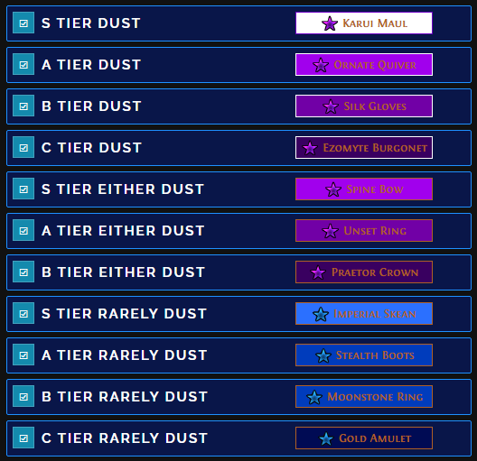
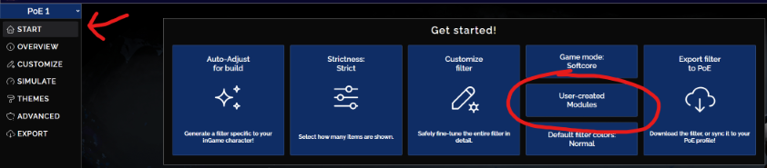
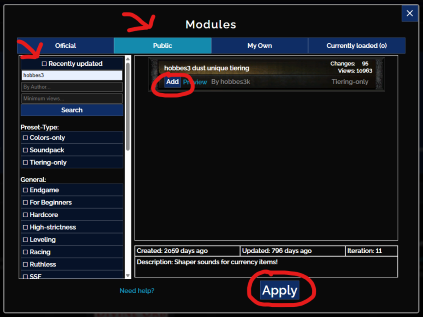
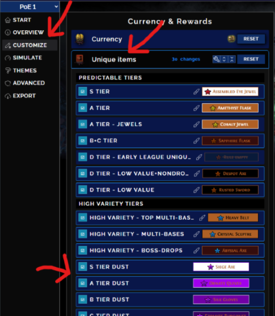
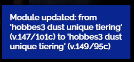

# hobbes3 dust unique tiering for FilterBlade

_Updated to 3.29 Allflame league!_

## Info

This module moves uniques out of the default tier to the new dust tiers based on the dust value vs price. By default, this module does _NOT_ hide any uniques. All values of dust is approximate due to item level, quality, and corruptions.

There are 3 types of tiers (all gold text):

- (Guaranteed) **Dust** (Tier)
  - The item will always dust well.
  - For example, there is only one unique "Blue Pearl Amulet", `Gloomfang`, and it dusts for 37k.
  - Filter: Purple background, white border
- **Either Dust**
  - The item will dust ok, but occasionally dusts even better.
  - For example, "Sinner Tricone" will usually be `Alpha's Howl` for 26k or it's sometimes `Assailum` for 42k.
  - Filter: Purple background, gold border
- **Rarely Dust**
  - The item usually won't dust well, but rarely will dust very well.
  - This is like checking "Heavy Belt" for a `Mageblood` jackpot.
  - For example, "Imperial Skean" is almost always `White Wind` for 14k, but very rarely it can be `Divinarius` for 1.4M!
  - Filter: Blue background, gold border

### **TLDR**: Auto-pickup purple background, check blue.

Generally, purple items gives more consistent, but lower dust, while blue items give higher dust if it's valuable.

The applicable uniques are those found during normal mapping. Some, but not all, uniques are categorized from boss drops or selection windows like Ritual.

Lastly, don't forget to 20% quality any good dusting uniques and keep Rog happy!

## How to install

1. Create a new filter or load an existing one
2. Select "START" sidebar
3. Click "User-created Modules"

4. Select "Public" tab
5. Uncheck "Recently updated"
6. Search "hobbes3" (this may take a minute)
7. Click "Add" within the result
8. Click "Apply" at the bottom

9. Select the "CUSTOMIZE" sidebar
10. Expand "Unique items" to see the new tiers

## How to update

Simply load your filter with the module on FilterBlade and you'll see a popup like this on the lower right:

## Suggestions or issues

For suggestions, please [create a new discussion](../../discussions).

For issues, please [create a new issue](../../issues).

## Troubleshooting

Start with a clean filter and re-add the module.

If you still need help, then feel free to [create a new discussion](../../discussions).

## Resources

- https://poedb.tw/us/Kingsmarch#Disenchant
- https://www.filterblade.xyz/?game=Poe1
